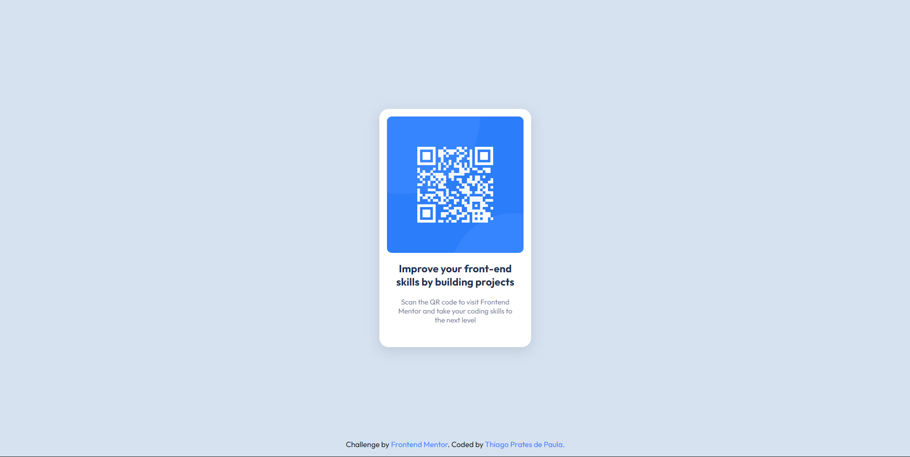

# Frontend Mentor - QR code component solution

This is a solution to the [QR code component challenge on Frontend Mentor](https://www.frontendmentor.io/challenges/qr-code-component-iux_sIO_H). 

## Table of contents

- [Frontend Mentor - QR code component solution](#frontend-mentor---qr-code-component-solution)
  - [Table of contents](#table-of-contents)
  - [Overview](#overview)
    - [Screenshot](#screenshot)
    - [Links](#links)
  - [My process](#my-process)
    - [Built with](#built-with)
    - [What I learned](#what-i-learned)
  - [Author](#author)

## Overview

### Screenshot

### Links

- Solution URL: [Add solution URL here](https://www.frontendmentor.io/solutions/simple-qr-code-component-using-html-and-css-kyEYJEfu5)
- Live Site URL: [Add live site URL here](https://thiago-prates.github.io/qr-code-component/)

## My process

### Built with

- Semantic HTML5 markup
- CSS custom properties
- Flexbox

### What I learned

For this initial project, i'm just training the basic of HTML and CSS
in addition to getting to know the features of Front-End Mentor.

## Author

- Frontend Mentor - [@Thiago-Prates](https://www.frontendmentor.io/profile/Thiago-Prates)
- GitHub - [Thiago Prates](https://github.com/Thiago-Prates)

